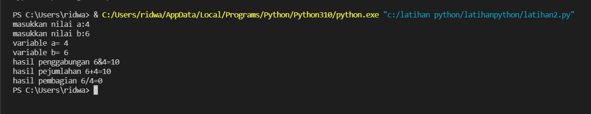

# latihanpython

# Code Program 

    print("**********")
    print("= NAMA    : RIDWAN ABDULAH")
    print("= NIM     : 312110369        ")
    print("= KELAS   : TI.21 C.5         ")
    print("**********")

    print("Please enter your full name : ")
    fullname=input()
    print("Please enter nickname : ")
    nickname=input()
    print("Please enter your NPM : ")
    npm=int(input())
    print("Please enter place of birth : ")
    pob=input()
    print("Please enter date of birth : ")
    date=int(input())
    print("Please enter your month of birth : ")
    month=input()
    print("Please enter year of birth : ")
    year=int(input())
    print("Please enter your phone number : ")
    phone=int(input())
    print("Please enter your address : ")
    address=input()

    dob=2021-year

    print("\n\n Assalamu'alaikum. ")
    print(f"Let me introduce myself, my name is {fullname}, but you can call me {nickname}, my NPM {npm}, I was born in {pob} and i am {dob} years old, I am very glad if you want to invite my house in {address}, So don't forget to call me before with the number {phone}, \n\n Thank you ")

output latihan 1

# Code Program Latihan2

    a=int(input("masukkan nilai a:"))
    b=int(input("masukkan nilai b:"))
    print("variable a=",a)
    print("variable b=",b)
    print("hasil penggabungan {1}&{0}=%d".format(a,b) %(a+b))

    #konversi nilai variable
    a=int(a)
    b=int(b)
    print("hasil pejumlahan {1}+{0}=%d".format(a,b) %(a+b))
    print("hasil pembagian {1}/{0}=%d".format(a,b) %(a/b))

# output latihan 2

